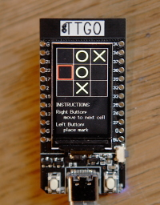
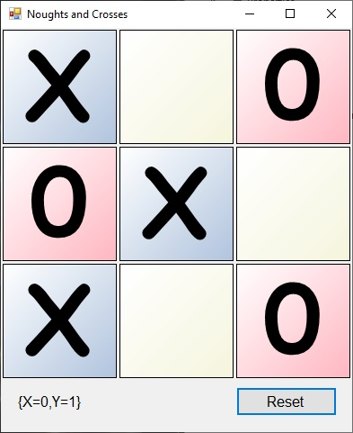

# NoughtsAndCrosses
Realising a simple OOP game in several different languages.

Sample showing the game running on an ESP32 development board.

Sample showing the game running on WIndows 10 desktop (C# version).

The aim of this project is to demonstrate a small object orientated game in several different languages. In each language the class definition should have identical properties, methods, events(/callbacks).

When I get round to uploading examples, each example should have sufficient instructions to download and compile the example.

Samples include Visual Studio 2019 for C# and C++, Freepascal & Delphi (5 & 10) for pascal, Eclipse for Java, PlatformIO and/or Arduino for small devices.
